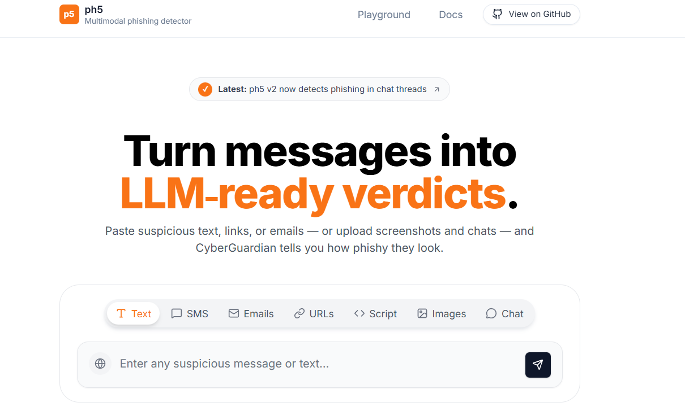

<div align="center">

  

  <br>

  <h1>Multimodal Phishing Detector</h1>
  <p>
    
    
    
    
    
    
    
  </p>
  <p><em>Advanced phishing detection using screenshots, message text, and URLs — powered by BERT, DistilBERT, ResNet50 & OCR</em></p>

</div>


## Overview

A comprehensive multimodal phishing detection system that combines:

- **Text-based detection** using fine-tuned BERT model
- **URL threat classification** with DistilBERT multiclass classification
- **Image-based phishing detection** leveraging ResNet50 with optional OCR
- **Fusion logic** to combine multimodal signals
- **FastAPI backend** with **React frontend**
- **Chat mode** powered by a constrained LLM for safe explanations

Complete pipeline from training to evaluation to inference with production-ready UI.

---

## Model Performance

Evaluation results from comprehensive testing:

| Modality | Model | Accuracy | Precision | Recall | F1 Score |
|----------|-------|----------|-----------|--------|----------|
| **Image** | ResNet50 (25 epochs, best val: 83.30%) | 78.99% | 72.69% | 82.63% | 77.34% |
| **Text** | Fine-tuned BERT | 97.22% | 97.51% | 95.84% | 96.67% |
| **URL** | DistilBERT (3-class) | **99.50%** | 99.49% | 99.49% | 99.49% |

**Key Metrics:**
- Image model best validation accuracy: **83.30%**
- Text model ROC-AUC: **0.9961**
- URL model overall accuracy: **99.50%**

---

## Detailed URL Classification Results

**Test Dataset:** 22,182 samples  
**Overall Accuracy:** 99.50%  
**Macro F1:** 0.9949  
**Weighted F1:** 0.9950

### Per-Class Performance

| Class | Precision | Recall | F1 Score | Support |
|-------|-----------|--------|----------|---------|
| Benign | 99.64% | 100.00% | 99.82% | 7,500 |
| Phishing | 99.18% | 99.43% | 99.30% | 7,182 |
| Malware | 99.65% | 99.05% | 99.35% | 7,500 |

**Generated Visualizations:**
- `runs/url_eval/roc_curves.png`
- `runs/url_eval/confusion_matrix.png`
- `runs/url_eval/confidence_histogram.png`

---

## Tech Stack

### Backend & ML
- **FastAPI** - High-performance async API framework
- **PyTorch** - Deep learning framework
- **Torchvision** - Computer vision models (ResNet50)
- **Transformers (HuggingFace)** - BERT and DistilBERT implementations
- **Scikit-learn** - ML utilities and metrics
- **Pandas & NumPy** - Data processing
- **Pytesseract** - OCR capabilities (optional)
- **Uvicorn** - ASGI server

### Frontend
- **React (Vite)** - Modern frontend framework
- **Tailwind CSS** - Utility-first styling
- **Shadcn UI** - Component library
- **Framer Motion** - Animation library

---

## Project Structure

### Backend Components

```
backend/
├── app/
│   ├── main.py              # FastAPI routes and endpoints
│   ├── models_loader.py     # Model initialization and loading
│   ├── predictors.py        # Text/URL/Image inference logic
│   ├── intent.py            # Multimodal intent detection
│   └── llm_helpers.py       # LLM-based explanations
```

### Key Modules

- **main.py** - API routes for inference and chat
- **models_loader.py** - Loads BERT, DistilBERT, and ResNet50 models
- **predictors.py** - Handles predictions for each modality
- **intent.py** - Combines multimodal signals for final detection
- **llm_helpers.py** - Generates safe, constrained explanations

---

## Datasets

### Image Data
- CIRCL phishing dataset
- OpenPhish screenshot collection
- Kaggle phishing screenshot datasets

### Text Data
- HuggingFace phishing datasets
- Custom phishing message collection

### URL Data
- **Tranco** - Benign URLs
- **PhishTank** - Phishing URLs
- **URLHaus** - Malware URLs

All datasets used within their respective license constraints.

---

## Setup

### Environment Configuration

1. Copy the example environment file:
```bash
copy .env.example .env
```

2. Configure the following variables:
```env
MM_TEXT_MODEL_DIR=path/to/text/model
MM_URL_MODEL_DIR=path/to/url/model
MM_IMAGE_MODEL_PATH=path/to/image/model
MM_USE_OCR=true
MM_TESSERACT_CMD=path/to/tesseract
# Add LLM provider keys if using chat features
```

### Backend Setup

```powershell
# Activate virtual environment
.\phishingenv\Scripts\Activate.ps1

# Install dependencies
pip install -r requirements.txt

# Start server
cd backend
uvicorn app.main:app --reload --host 127.0.0.1 --port 8000
```

### Frontend Setup

```powershell
cd frontend
npm install
npm run dev
```

The application will be available at:
- **Backend API:** http://127.0.0.1:8000
- **Frontend:** http://localhost:5173

---

## Contributing

Contributions are welcome! Please follow these guidelines:

1. Fork the repository
2. Create a feature branch (`git checkout -b feature/improvement`)
3. Commit your changes (`git commit -am 'Add new feature'`)
4. Push to the branch (`git push origin feature/improvement`)
5. Open a Pull Request

**Important:**
- Do not commit model weights or datasets
- Follow code formatting standards (`black`, `isort` for Python)
- Add tests for new features
- Update documentation as needed

---

## License

This project is licensed under the MIT License - see the LICENSE file for details.

---

<div align="center">

**Made with care 💌 by Akash**

_If you find this project helpful, please consider giving it a star ⭐_

</div>